# HTML & CSS Assignment 1

**Student:** Askhat Almadi
**Group:** IT-2513

## About the project

This is my first HTML and CSS webpage. The goal of this assignment was to learn the basic HTML structure and practice different HTML and CSS techniques.

## Assignment Tasks

### HTML

* Created the basic HTML structure.
* Added headings and text.
* Added ordered and unordered lists.
* Added links and an image.
* Added a button.
* Created a schedule table.
* Added emojis.
* Created a form with text, email and color inputs.

### CSS

* Used inline CSS.
* Used internal CSS inside the `<head>`.
* Used external CSS in `style.css`.
* Used element, class and ID selectors.
* Added a favicon.
* Used `div` elements for different sections.
* Practiced the CSS box model.
* Used static, relative and absolute positioning.
* Used `px`, `%`, `em` and `rem` units.
* Used `float` and `clear`.

## Screenshots

### 1. Website — Main Part

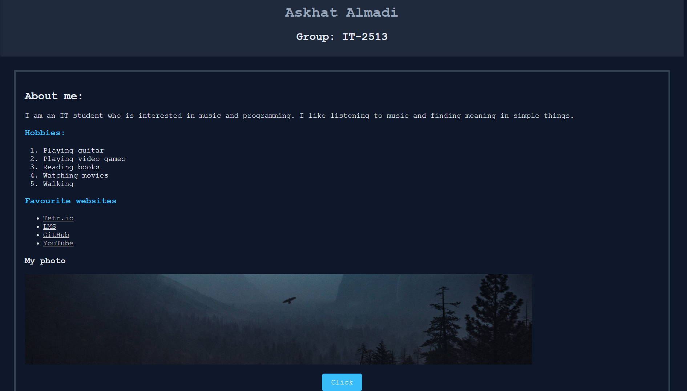

### 2. HTML Code — Part 1

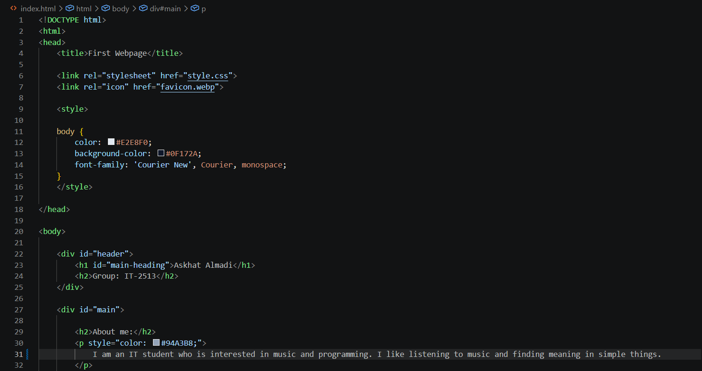

### 3. HTML Code — Part 2

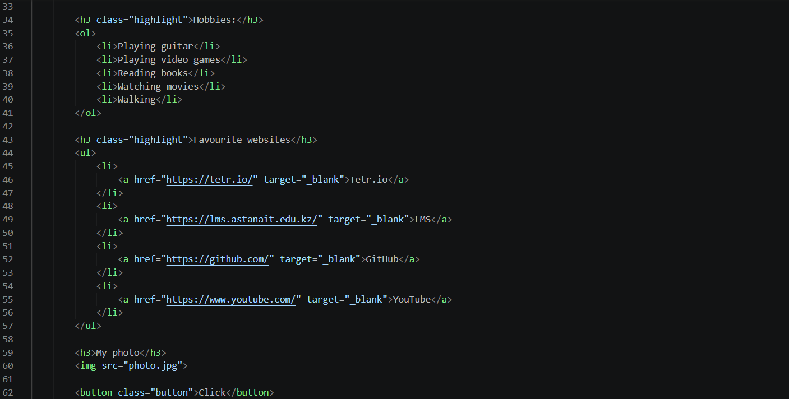

### 5. Schedule

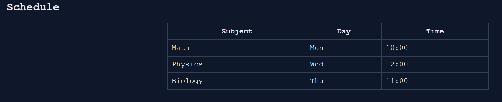

### 6. Schedule Code

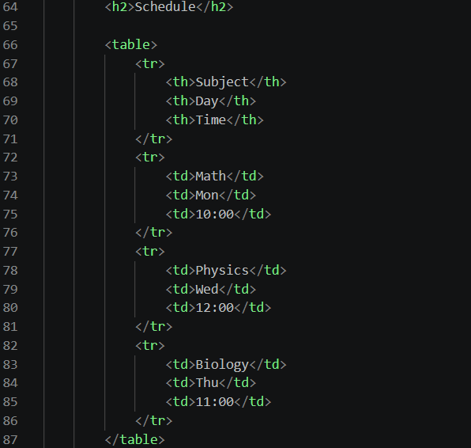

### 7. Form

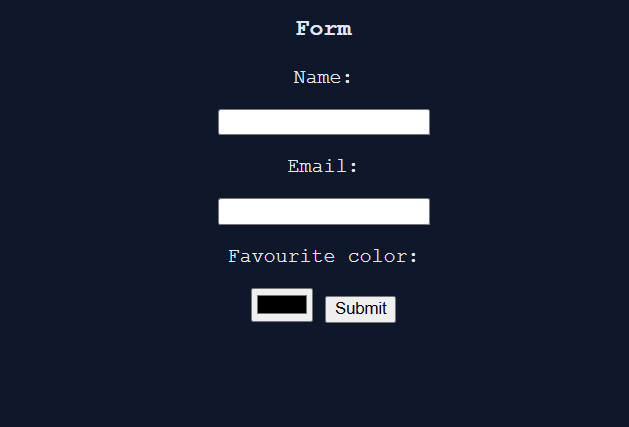

### 8. Form Code

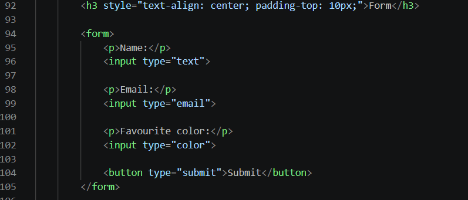

### 9. CSS in HTML Head

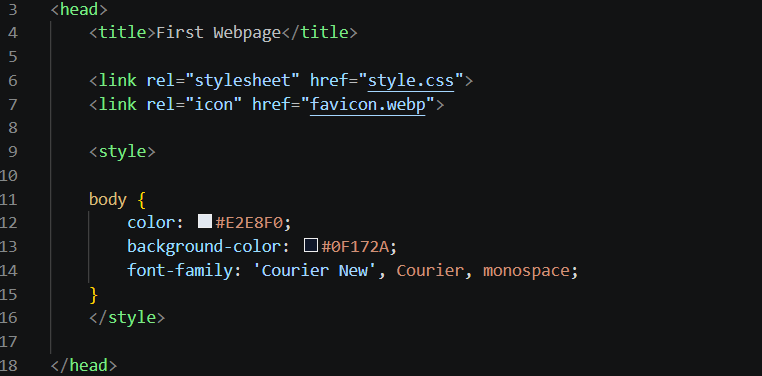

### 10. External CSS — Part 1

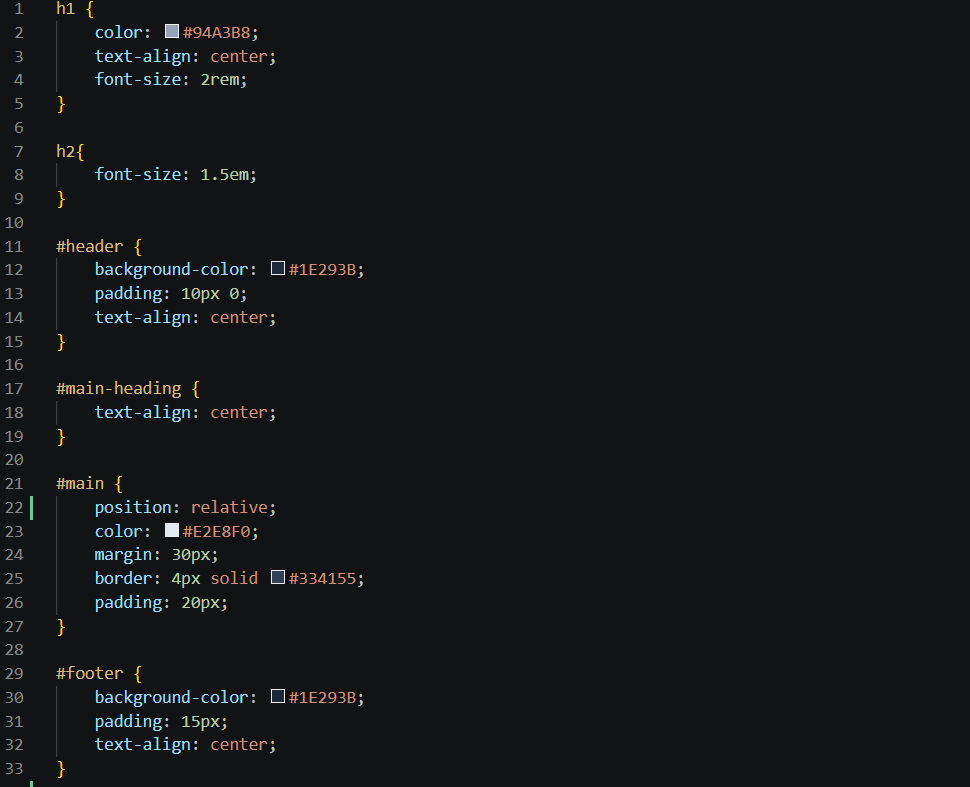

### 11. External CSS — Part 2

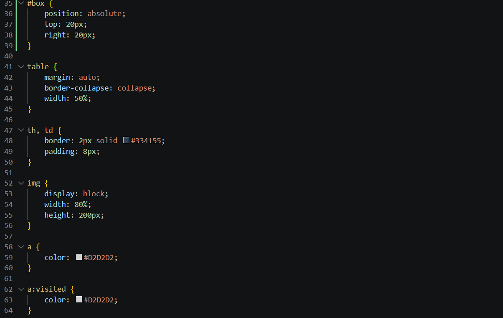

### 12. External CSS — Part 3

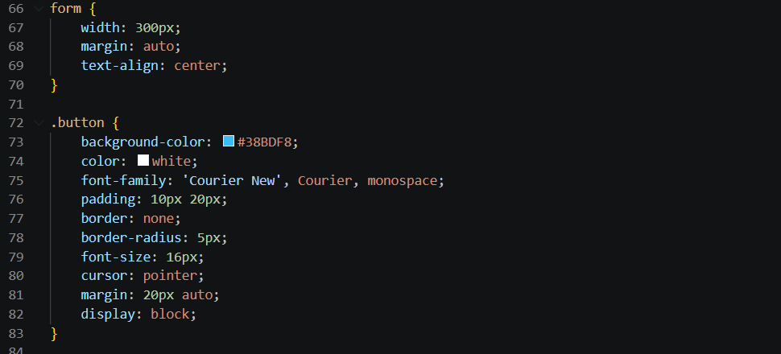

### 13. External CSS — Part 4

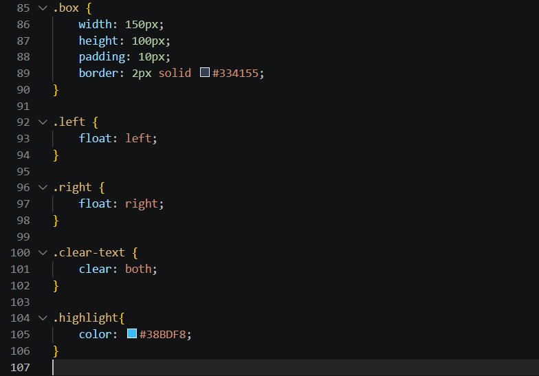

## Work Process

First, I created the basic HTML structure and added the required content. Then I added headings, lists, links, an image, a button, a table and a form. After that, I worked with different types of CSS: inline, internal and external CSS. I also practiced selectors, the box model, positioning, sizing, float and clear. Finally, I uploaded the project to GitHub.

## Files

* `index.html` — main HTML file
* `style.css` — external CSS file
* `photo.jpg` — image used on the webpage
* `favicon.webp` — favicon
* `screenshots/` — screenshots of the assignment

## Technologies

* HTML
* CSS
* GitHub Pages
